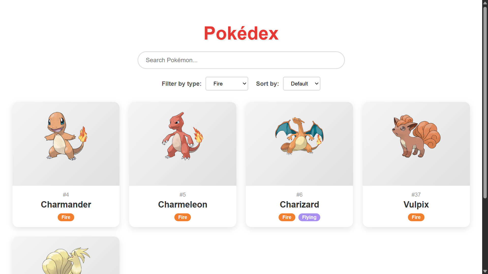
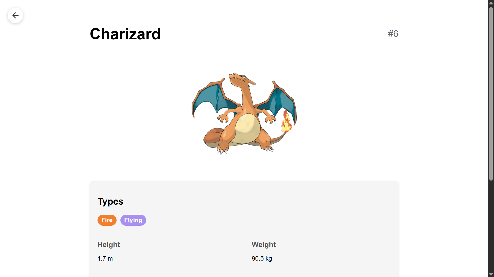
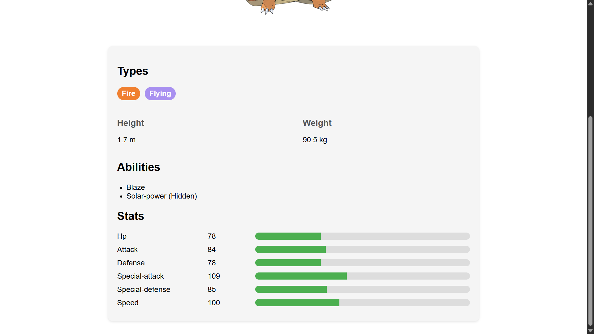

# 🚀 POKEDEX-ANGULAR

**Pokedex-Angular** est une application web réactive développée en Angular 19 et TypeScript, conçue en **Pair Programming** pour garantir une qualité de code optimale et un apprentissage mutuel.


---

## 📋 Table des matières

- [Présentation](#-présentation)
- [Fonctionnalités](#-fonctionnalités)
- [Documentation technique](#-documentation-technique)
- [Installation & Setup](#-installation--setup)
- [Configuration](#-configuration)
- [Utilisation & Tests](#-utilisation--tests)
- [Bonnes pratiques](#-bonnes-pratiques)
- [Contribuer](#-contribuer)
- [Roadmap](#-roadmap)
- [FAQ](#-faq)
- [Auteurs](#-auteurs)
- [Licence](#-licence)

---

## 📌 Présentation

**Pokedex-Angular** est une application web riche et réactive développée avec Angular 19 et TypeScript.  
Conçue dans un esprit **Pair Programming**, chaque fonctionnalité est co-développée et relue en temps réel pour garantir :
- ✔️ Une qualité de code optimale  
- 🚀 Une montée en compétence accélérée  
- 🤝 Une collaboration fluide  

Cette application consomme la [PokeAPI](https://pokeapi.co/).

---

## ✨ Fonctionnalités

- 🔍 **Recherche** de Pokémon par nom
- 📄 **Pagination** (50 Pokémon par page, paramétrable)
- 📊 **Filtrage** par type (Feu, Eau, Plante…)
- 📋 **Fiche détaillée** pour chaque Pokémon (stats, évolutions)
- ↔️ **Recherche en temps réel** avec Reactive Forms
- 🔄 **Mise à jour dynamique** sans rechargement complet

---

## 📌 Documentation technique

L'ensemble des diagrammes, séquences et extraits de code se trouve dans le fichier dédié [TECHNICAL.md](TECHNICAL.md).

---

## 💻 Installation & Setup

### Prérequis

- Node.js ≥ 16
- Angular CLI (`npm install -g @angular/cli`)
- npm ou yarn

### Cloner & installer

```bash
git clone https://github.com/AzrySimplon/pokedex.git
cd pokedex
npm install  # ou yarn install
```

---

## ⚙️ Configuration

```ts
// src/environments/environment.ts
export const environment = {
  production: false,
  pokeApiBaseUrl: 'https://pokeapi.co/api/v2',
  pageLimit: 50
};
```

---

## 🧪 Utilisation & Tests

```bash
ng serve    # développement
ng test     # tests unitaires
ng e2e      # tests end-to-end
```

Accéder à http://localhost:4200

---

## ✅ Bonnes pratiques

- Rotation Driver/Navigator toutes les 30 min
- Commits atomiques et messages clairs (RFC commit)
- Modules, composants et services séparés
- Usage du pipe `async` pour les Observables
- Couverture par tests unitaires et e2e via Jest/Protractor

---

## 📌 Contribuer

Voir [CONTRIBUTING.md](CONTRIBUTING.md) pour le guide de contribution et les templates d’issues.

---

## 🚀 Roadmap

Voir [ROADMAP.md](ROADMAP.md) pour les prochaines évolutions :

- [x] Organisation du Pair Programming  
- [x] Conception de l’architecture Angular  
- [x] Implémentation de la recherche, pagination et filtrage  
- [x] Développement et intégration du thème sombre/clair 

---

## ❓ FAQ

### Qu’est-ce que le Pair Programming ?
Deux développeurs travaillent ensemble :
- **Driver** : écrit le code
- **Navigator** : vérifie, guide et anticipe

### Fréquence de rotation
Toutes les 30 minutes (à adapter selon l’équipe).

### Avantages
- Qualité de code accrue
- Détection précoce des erreurs
- Partage de connaissances

---

## 📌 Auteur

👨‍💻 **Azriel** – Étudiant développeur Fullstack Java / Angular  
🎓 Projet réalisé en duo dans le cadre de la formation Simplon, promotion 2025  
🔧 Rôle principal et responsabilités :  
- Conception et mise en place de l’architecture Angular (AppModule, modules, routing)  
- Développement des services techniques (`PokeApiService`) et intégration de la PokeAPI  
- Création et implémentation des composants principaux (`SearchComponent`, `ListComponent`, `DetailComponent`)   
📅 Période du projet : Juin 2025  
🌐 Contact & suivi : [GitHub AzrySimplon](https://github.com/AzrySimplon)

---

👨‍💻 **Quentin** – Étudiant développeur Fullstack Java / Angular  
🎓 Projet réalisé en duo dans le cadre de la formation Simplon, promotion 2025  
🔧 Rôle principal et responsabilités :  
- Coordination du Pair Programming  
- Revue de code systématique et définition des bonnes pratiques  
- Rédaction de la documentation complète (README, guides d’installation et usage)  
📅 Période du projet : Juin 2025  
🌐 Contact & suivi : [GitHub Quentin384](https://github.com/Quentin384)

---

## 📜 Licence

MIT – voir [LICENSE](LICENSE)

---

## 📸 Captures d'écran

Voici quelques aperçus de l’application en fonctionnement :


*Vue générale de la page d'acceuil*


*Vue générale de la page d'un pokemon*


*Vue générale des details d'un pokemon*


