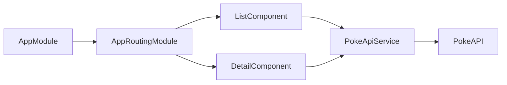
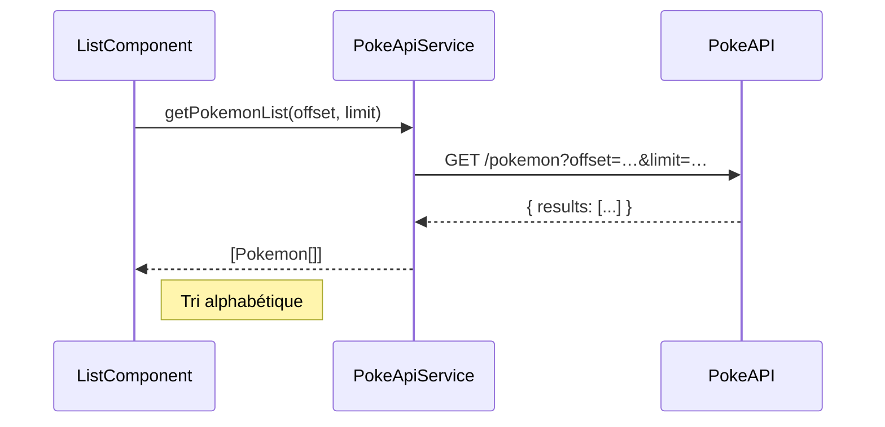
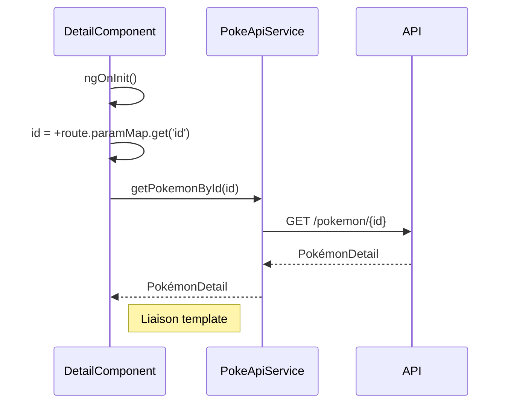

# Documentation Technique

## Architecture & Collaboration

### Flux de données

```mermaid
flowchart LR
  AppModule --> AppRoutingModule
  AppRoutingModule --> ListComponent
  AppRoutingModule --> DetailComponent
  ListComponent --> PokeApiService
  DetailComponent --> PokeApiService
  PokeApiService --> PokeAPI
```

### Chargement d’une page

```mermaid
sequenceDiagram
  participant List as ListComponent
  participant Service as PokeApiService
  participant API as PokeAPI
  List->>Service: getPokemonList(offset, limit)
  Service->>API: GET /pokemon?offset=…&limit=…
  API-->>Service: { results: [...] }
  Service-->>List: [Pokemon[]]
  Note right of List: Tri alphabétique
```

### Détail d’un Pokémon

```mermaid
sequenceDiagram
  participant Detail as DetailComponent
  participant Service as PokeApiService
  Detail->>Detail: ngOnInit()
  Detail->>Detail: id = +route.paramMap.get('id')
  Detail->>Service: getPokemonById(id)
  Service->>API: GET /pokemon/{id}
  API-->>Service: PokémonDetail
  Service-->>Detail: PokémonDetail
  Note right of Detail: Liaison template
```

