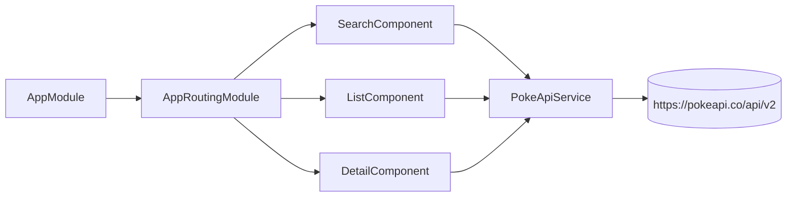
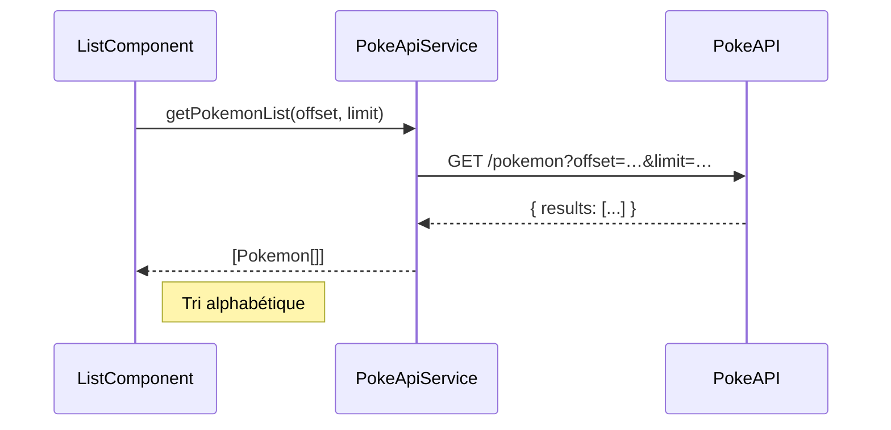
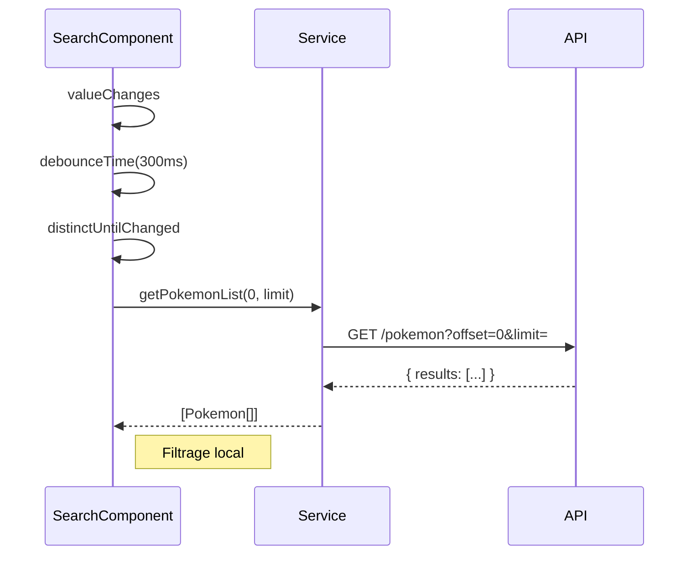
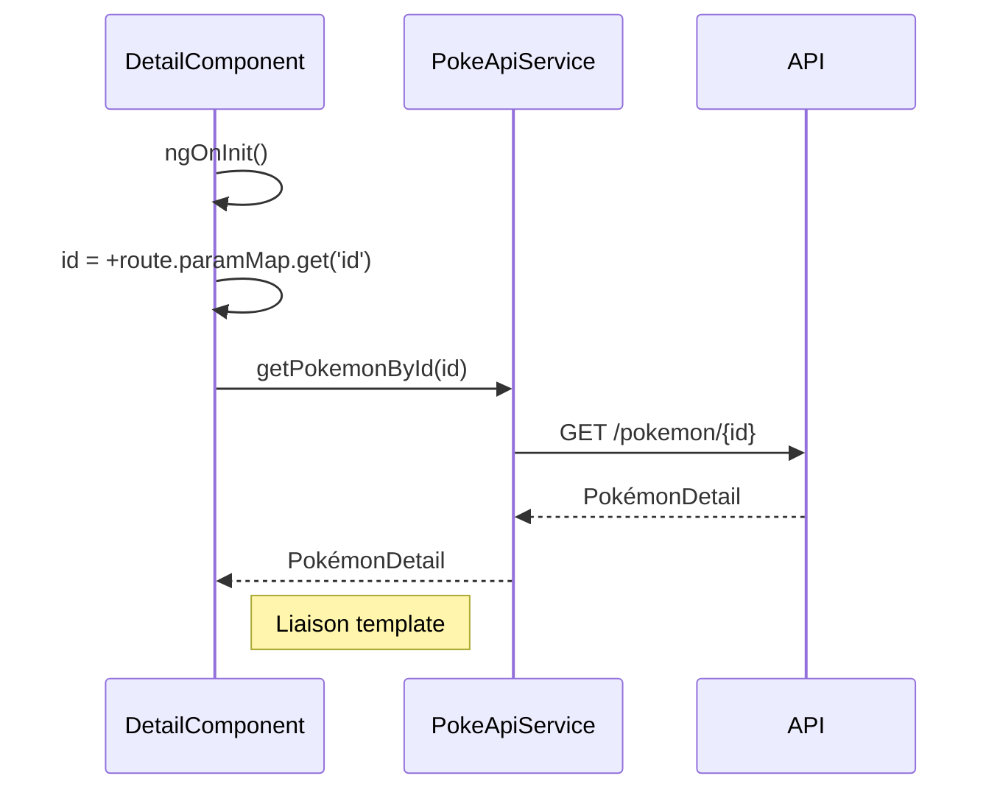

# Documentation Technique

## Architecture & Collaboration

### Flux de données



### Chargement d’une page



1. `ngOnInit()` de `ListComponent` appelle `loadPage(0)`.
2. `getPokemonList(offset, limit)` construit l’URL et envoie la requête GET.
3. La réponse `{ results: Pokémon[] }` est transformée en `Observable<Pokemon[]>`.
4. `ListComponent` trie et affiche.

### Recherche dynamique



- Utilisation de `FormControl.valueChanges` + `debounceTime` + `distinctUntilChanged` + `switchMap`.
- Filtrage local : `.filter(p => p.name.includes(term))`.

### Détail d’un Pokémon



- `ActivatedRoute` pour récupérer l’`id`.
- `getPokemonById(id)` renvoie un `Observable<PokemonDetail>` pour le template.

## Extraits de code

**AppModule**
```ts
@NgModule({
  imports: [
    BrowserModule,
    HttpClientModule,
    ReactiveFormsModule,
    AppRoutingModule
  ],
  bootstrap: [AppComponent]
})
export class AppModule {}
```

**PokeApiService**
```ts
@Injectable({ providedIn: 'root' })
export class PokeApiService {
  constructor(private http: HttpClient) {}

  getPokemonList(offset: number, limit: number): Observable<Pokemon[]> {
    return this.http
      .get<{ results: Pokemon[] }>(`${environment.pokeApiBaseUrl}/pokemon?offset=${offset}&limit=${limit}`)
      .pipe(map(res => res.results));
  }

  getPokemonById(id: number): Observable<PokemonDetail> {
    return this.http.get<PokemonDetail>(`${environment.pokeApiBaseUrl}/pokemon/${id}`);
  }
}
```
